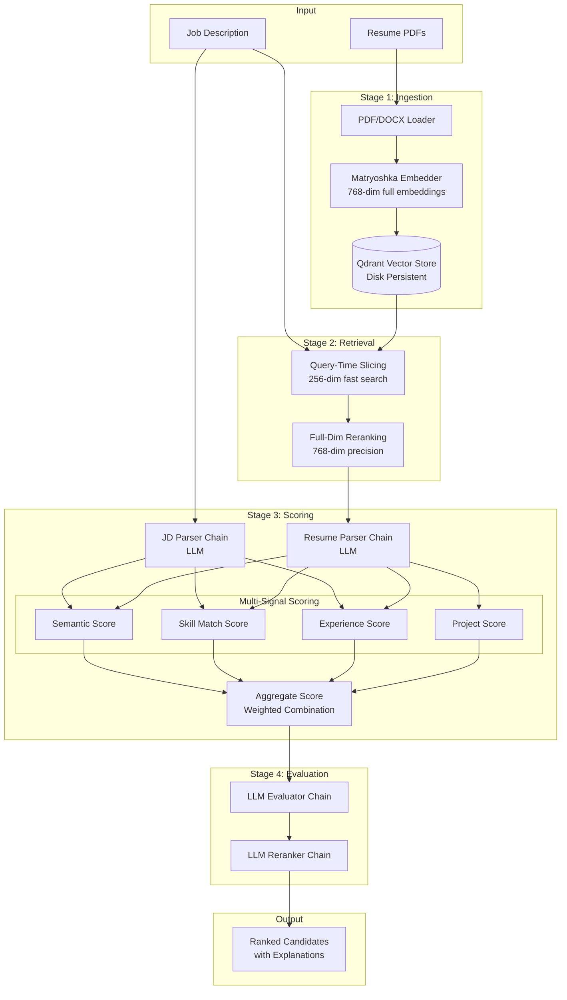

# Resume Analyser

An industry-grade, high-accuracy resume ranking pipeline that uses multi-signal scoring and LLM-powered evaluation to match candidates to job descriptions.

## ✨ Features

- **Matryoshka Embeddings** - Two-stage search with 256-dim fast retrieval + 768-dim precision reranking
- **Multi-Signal Scoring** - Combines semantic similarity, skill match, experience fit, and project relevance
- **LLM Evaluation** - Azure OpenAI-powered candidate assessment and final reranking
- **Persistent Vector Store** - Qdrant with disk persistence for efficient resume storage
- **CLI Runner** - Simple local execution without FastAPI overhead

## 🏗️ Architecture



## 📁 Project Structure

```
Resume_Analyser/
├── run.py                    # CLI entry point
├── requirements.txt          # Python dependencies
├── .env                      # Azure OpenAI credentials
├── resumes/                  # Input resume PDFs
├── qdrant_data/              # Persistent vector storage
└── app/
    ├── chains/               # LangChain LLM chains
    │   ├── jd_parser_chain.py
    │   ├── resume_parser_chain.py
    │   ├── llm_evaluator_chain.py
    │   └── reranker_chain.py
    ├── config/               # Pydantic settings
    │   └── settings.py
    ├── embeddings/           # Matryoshka embeddings
    │   └── matryoshka_embedder.py
    ├── loaders/              # Document loaders
    │   ├── resume_loader.py
    │   └── jd_loader.py
    ├── schemas/              # Pydantic models
    │   ├── jd_schema.py
    │   └── resume_schema.py
    ├── scoring/              # Multi-signal scoring
    │   ├── semantic_match.py
    │   ├── skill_match.py
    │   ├── experience_score.py
    │   └── aggregate_score.py
    ├── utils/                # Utilities
    └── vector_store/         # Qdrant integration
        └── qdrant_store.py
```

## 🚀 Quick Start

### 1. Install Dependencies

```bash
pip install -r requirements.txt
```

### 2. Configure Environment

Create a `.env` file:

```env
AZURE_OPENAI_ENDPOINT=https://your-resource.openai.azure.com/
AZURE_OPENAI_API_KEY=your-api-key
AZURE_OPENAI_DEPLOYMENT=gpt-4o
AZURE_OPENAI_API_VERSION=2024-02-15-preview
```

### 3. Add Resumes

Place PDF or DOCX resumes in the `resumes/` folder.

### 4. Run the Pipeline

```bash
python run.py
```

## ⚙️ Configuration

### Scoring Weights

Adjust weights in `.env`:

| Signal | Default Weight | Description |
|--------|---------------|-------------|
| `SCORE_SEMANTIC_WEIGHT` | 0.40 | Semantic similarity |
| `SCORE_SKILL_WEIGHT` | 0.30 | Skill match |
| `SCORE_EXPERIENCE_WEIGHT` | 0.20 | Experience fit |
| `SCORE_PROJECT_WEIGHT` | 0.10 | Project relevance |

## 🔍 Pipeline Steps

| Step | Description |
|------|-------------|
| 1 | Check vector store, ingest resumes if empty |
| 2 | Parse job description with LLM |
| 3 | Two-stage semantic search (256-dim → 768-dim) |
| 4 | Parse top candidate resumes with LLM |
| 5 | Compute multi-signal scores |
| 6 | LLM evaluation of each candidate |
| 7 | Sort by aggregate score |
| 8 | LLM reranking for final order |
| 9 | Output ranked candidates with explanations |

## 🛠️ Tech Stack

- **LLM** - Azure OpenAI (GPT-4o)
- **Embeddings** - Sentence Transformers (Matryoshka)
- **Vector Store** - Qdrant (local, persistent)
- **Framework** - LangChain
- **Validation** - Pydantic

## 📄 License

MIT
